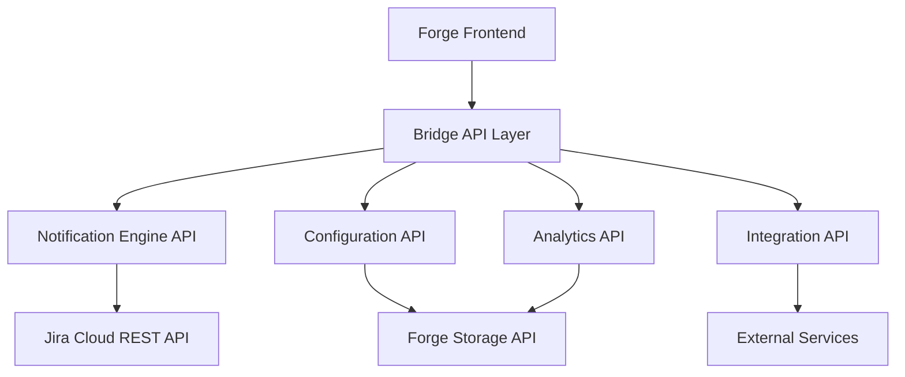

# API Reference - Gentle Nudge Assistant

This comprehensive API reference covers all internal APIs, extension points, and integration capabilities available in Gentle Nudge Assistant for developers, integrators, and advanced users.

## Table of Contents

1. [Overview](#overview)
2. [Authentication & Authorization](#authentication--authorization)
3. [Core APIs](#core-apis)
4. [Notification APIs](#notification-apis)
5. [Configuration APIs](#configuration-apis)
6. [Analytics APIs](#analytics-apis)
7. [Extension Points](#extension-points)
8. [Webhook Integration](#webhook-integration)
9. [SDK and Libraries](#sdk-and-libraries)
10. [Error Handling](#error-handling)

## Overview

Gentle Nudge Assistant provides a comprehensive set of APIs built on Atlassian Forge platform, offering both internal extension capabilities and external integration options.

### API Architecture



### Base Configuration

```typescript
// Base API configuration
const API_CONFIG = {
  baseUrl: '/api/v1',
  version: '1.0.0',
  authentication: 'forge-bridge',
  rateLimit: {
    requests: 100,
    window: 60 // seconds
  }
}
```

## Authentication & Authorization

### Forge Bridge Authentication

All API calls are authenticated through Atlassian Forge Bridge, ensuring secure access to user data and Jira resources.

```typescript
import { requestJira } from '@forge/bridge';

// Authenticated API request
const makeAuthenticatedRequest = async (endpoint: string, options = {}) => {
  return await requestJira(`/rest/api/3/${endpoint}`, {
    method: 'GET',
    headers: {
      'Accept': 'application/json',
      'Content-Type': 'application/json'
    },
    ...options
  });
};
```

### Permission Scopes Required

```yaml
permissions:
  required_scopes:
    - read:jira-work        # Access to issues and projects
    - read:jira-user        # User profile information
    - storage:app           # App data storage
  
  optional_scopes:
    - write:jira-work       # Update issue properties
    - manage:jira-project   # Project-level configuration
```

### User Context

```typescript
interface UserContext {
  accountId: string;
  displayName: string;
  emailAddress: string;
  timezone: string;
  locale: string;
  permissions: string[];
}

// Get current user context
const getUserContext = (): Promise<UserContext> => {
  return requestJira('/rest/api/3/myself');
};
```

## Core APIs

### Issue Analysis API

Retrieve and analyze issue data for notification decisions.

#### Get Stale Issues

```typescript
/**
 * Retrieve stale issues for a user
 */
interface StaleIssueRequest {
  userId: string;
  threshold: number;      // Days since last update
  projectKeys?: string[]; // Optional project filter
  priorities?: string[];  // Optional priority filter
  maxResults?: number;    // Default: 50, Max: 100
}

interface StaleIssue {
  key: string;
  summary: string;
  status: string;
  priority: string;
  assignee: User;
  lastUpdated: Date;
  daysSinceUpdate: number;
  project: Project;
  staleness_score: number; // 0.0 - 1.0
}

const getStaleIssues = async (request: StaleIssueRequest): Promise<StaleIssue[]> => {
  return await makeAuthenticatedRequest('gentle-nudge/stale-issues', {
    method: 'POST',
    body: JSON.stringify(request)
  });
};
```

#### Get Deadline Issues  

```typescript
/**
 * Retrieve issues with approaching deadlines
 */
interface DeadlineRequest {
  userId: string;
  daysAhead: number;      // Look ahead period
  deadlineTypes: ('due_date' | 'sla' | 'custom')[];
  includeOverdue?: boolean;
}

interface DeadlineIssue {
  key: string;
  summary: string;
  deadline: Date;
  deadlineType: string;
  daysUntilDeadline: number;
  urgencyScore: number;   // 0.0 - 1.0
  project: Project;
  assignee: User;
}

const getDeadlineIssues = async (request: DeadlineRequest): Promise<DeadlineIssue[]> => {
  return await makeAuthenticatedRequest('gentle-nudge/deadline-issues', {
    method: 'POST',
    body: JSON.stringify(request)
  });
};
```

#### Workload Analysis

```typescript
/**
 * Analyze user workload for intelligent notification throttling
 */
interface WorkloadAnalysisRequest {
  userId: string;
  timeframe: 'current' | 'week' | 'sprint';
  includeComplexity?: boolean;
}

interface WorkloadAnalysis {
  totalAssignedIssues: number;
  activeIssues: number;
  recentActivity: number;    // Issues updated in last 7 days
  complexityScore: number;   // Estimated effort (0.0 - 1.0)
  capacityUtilization: number; // 0.0 - 1.0
  recommendedMaxNotifications: number;
}

const analyzeWorkload = async (request: WorkloadAnalysisRequest): Promise<WorkloadAnalysis> => {
  return await makeAuthenticatedRequest('gentle-nudge/workload-analysis', {
    method: 'POST',
    body: JSON.stringify(request)
  });
};
```

## Notification APIs

### Notification Management

#### Create Custom Notification

```typescript
/**
 * Create a custom notification
 */
interface CreateNotificationRequest {
  userId: string;
  type: 'stale' | 'deadline' | 'custom' | 'achievement';
  issueKey?: string;
  title: string;
  message: string;
  priority: 'low' | 'medium' | 'high' | 'critical';
  scheduledFor?: Date;     // Optional scheduling
  expiresAt?: Date;        // Optional expiration
  metadata?: Record<string, any>;
}

interface Notification {
  id: string;
  userId: string;
  type: string;
  title: string;
  message: string;
  priority: string;
  status: 'pending' | 'delivered' | 'dismissed' | 'actioned' | 'expired';
  createdAt: Date;
  deliveredAt?: Date;
  respondedAt?: Date;
  response?: 'dismissed' | 'acknowledged' | 'actioned' | 'snoozed';
  issueKey?: string;
  metadata?: Record<string, any>;
}

const createNotification = async (request: CreateNotificationRequest): Promise<Notification> => {
  return await makeAuthenticatedRequest('gentle-nudge/notifications', {
    method: 'POST',
    body: JSON.stringify(request)
  });
};
```

#### Get Notification History

```typescript
/**
 * Retrieve notification history for a user
 */
interface NotificationHistoryRequest {
  userId: string;
  startDate?: Date;
  endDate?: Date;
  types?: string[];
  statuses?: string[];
  limit?: number;         // Default: 50, Max: 200
  offset?: number;
}

const getNotificationHistory = async (request: NotificationHistoryRequest): Promise<{
  notifications: Notification[];
  totalCount: number;
  hasMore: boolean;
}> => {
  return await makeAuthenticatedRequest('gentle-nudge/notifications/history', {
    method: 'POST',
    body: JSON.stringify(request)
  });
};
```

#### Update Notification Status

```typescript
/**
 * Update notification status (user response)
 */
interface NotificationUpdateRequest {
  notificationId: string;
  status: 'dismissed' | 'acknowledged' | 'actioned' | 'snoozed';
  snoozeUntil?: Date;     // Required if status is 'snoozed'
  feedback?: {
    helpful: boolean;
    reason?: string;
    suggestions?: string;
  };
}

const updateNotificationStatus = async (request: NotificationUpdateRequest): Promise<Notification> => {
  return await makeAuthenticatedRequest(`gentle-nudge/notifications/${request.notificationId}`, {
    method: 'PUT',
    body: JSON.stringify(request)
  });
};
```

### Message Generation

#### Generate Encouraging Message

```typescript
/**
 * Generate contextual encouraging messages
 */
interface MessageGenerationRequest {
  type: 'stale' | 'deadline' | 'achievement' | 'team_update';
  context: {
    issueKey?: string;
    daysSinceUpdate?: number;
    daysUntilDeadline?: number;
    priority?: string;
    userPreferences: UserPreferences;
  };
  tone: 'encouraging' | 'professional' | 'casual' | 'custom';
  includeEmojis?: boolean;
  includeActions?: boolean;
}

interface GeneratedMessage {
  title: string;
  body: string;
  actions?: Array<{
    label: string;
    type: 'primary' | 'secondary';
    action: string;
    url?: string;
  }>;
  metadata: {
    tone: string;
    template_used: string;
    personalization_score: number;
  };
}

const generateMessage = async (request: MessageGenerationRequest): Promise<GeneratedMessage> => {
  return await makeAuthenticatedRequest('gentle-nudge/messages/generate', {
    method: 'POST',
    body: JSON.stringify(request)
  });
};
```

## Configuration APIs

### User Preferences

#### Get User Preferences

```typescript
/**
 * User preference data structure
 */
interface UserPreferences {
  userId: string;
  notificationFrequency: 'minimal' | 'gentle' | 'moderate' | 'custom';
  staleDaysThreshold: number;
  deadlineWarningDays: number[];
  communicationTone: 'encouraging' | 'professional' | 'casual' | 'custom';
  
  quietHours: {
    enabled: boolean;
    weekdays: {
      start: string;    // HH:mm format
      end: string;
    };
    weekends: {
      enabled: boolean;
      start?: string;
      end?: string;
    };
    holidays: boolean;
    timezone: string;
  };
  
  projectFilters: {
    mode: 'include' | 'exclude' | 'all';
    projectKeys: string[];
    priorities: string[];
    issueTypes: string[];
    excludeLabels: string[];
  };
  
  advancedSettings: {
    workloadSensitivity: boolean;
    maxDailyNotifications: number;
    learningEnabled: boolean;
    teamCollaboration: boolean;
  };
  
  customSettings?: Record<string, any>;
  lastModified: Date;
  version: string;
}

const getUserPreferences = async (userId: string): Promise<UserPreferences> => {
  return await makeAuthenticatedRequest(`gentle-nudge/users/${userId}/preferences`);
};
```

#### Update User Preferences

```typescript
/**
 * Update user preferences
 */
interface UpdatePreferencesRequest {
  userId: string;
  preferences: Partial<UserPreferences>;
  mergeMode?: 'replace' | 'merge';  // Default: 'merge'
}

const updateUserPreferences = async (request: UpdatePreferencesRequest): Promise<UserPreferences> => {
  return await makeAuthenticatedRequest(`gentle-nudge/users/${request.userId}/preferences`, {
    method: 'PUT',
    body: JSON.stringify(request.preferences)
  });
};
```

#### Validate Configuration

```typescript
/**
 * Validate user preferences before saving
 */
interface ValidationResult {
  valid: boolean;
  errors: Array<{
    field: string;
    message: string;
    suggestion?: string;
  }>;
  warnings: Array<{
    field: string;
    message: string;
    impact?: string;
  }>;
}

const validatePreferences = async (preferences: Partial<UserPreferences>): Promise<ValidationResult> => {
  return await makeAuthenticatedRequest('gentle-nudge/preferences/validate', {
    method: 'POST',
    body: JSON.stringify(preferences)
  });
};
```

### Team Configuration

#### Get Team Settings (Admin Only)

```typescript
/**
 * Team-level configuration
 */
interface TeamSettings {
  projectKey: string;
  defaultPreferences: Partial<UserPreferences>;
  escalationRules: Array<{
    trigger: 'stale_threshold' | 'missed_deadline' | 'no_response';
    condition: string;          // e.g., "days > 10"
    action: 'notify_lead' | 'create_task' | 'reassign';
    target?: string;           // User or group to notify
  }>;
  
  teamPolicies: {
    enforceQuietHours: boolean;
    mandatorySettings: string[];    // Settings that cannot be overridden
    recommendedSettings: string[];  // Suggested but optional settings
  };
  
  dashboard: {
    enabled: boolean;
    widgets: string[];
    refreshInterval: number;
    permissions: {
      view: string[];          // User groups with view access
      configure: string[];     // User groups with config access
    };
  };
}

const getTeamSettings = async (projectKey: string): Promise<TeamSettings> => {
  return await makeAuthenticatedRequest(`gentle-nudge/teams/${projectKey}/settings`);
};
```

## Analytics APIs

### Usage Analytics

#### Get Personal Analytics

```typescript
/**
 * Personal usage and effectiveness analytics
 */
interface PersonalAnalyticsRequest {
  userId: string;
  timeframe: 'week' | 'month' | 'quarter' | 'custom';
  startDate?: Date;       // Required if timeframe is 'custom'
  endDate?: Date;         // Required if timeframe is 'custom'
}

interface PersonalAnalytics {
  summary: {
    totalNotifications: number;
    responseRate: number;           // 0.0 - 1.0
    averageResponseTime: number;    // Hours
    effectivenessScore: number;     // 0.0 - 1.0
  };
  
  notificationBreakdown: {
    byType: Record<string, number>;
    byStatus: Record<string, number>;
    byPriority: Record<string, number>;
  };
  
  responseTrends: Array<{
    date: Date;
    notifications: number;
    responses: number;
    avgResponseTime: number;
  }>;
  
  productivityImpact: {
    ticketsUpdatedAfterNotification: number;
    averageUpdateDelay: number;     // Days
    stalenessImprovement: number;   // Percentage
    deadlineAdherence: number;      // Percentage
  };
}

const getPersonalAnalytics = async (request: PersonalAnalyticsRequest): Promise<PersonalAnalytics> => {
  return await makeAuthenticatedRequest('gentle-nudge/analytics/personal', {
    method: 'POST',
    body: JSON.stringify(request)
  });
};
```

#### Get Team Analytics (Admin Only)

```typescript
/**
 * Team-wide analytics and insights
 */
interface TeamAnalyticsRequest {
  projectKey: string;
  timeframe: 'week' | 'month' | 'quarter' | 'custom';
  startDate?: Date;
  endDate?: Date;
  includeIndividualMetrics?: boolean;
}

interface TeamAnalytics {
  teamSummary: {
    activeUsers: number;
    totalNotifications: number;
    teamResponseRate: number;
    averageEffectivenessScore: number;
  };
  
  ticketHealth: {
    averageStaleness: number;       // Days
    stalenessDistribution: Record<string, number>;
    deadlineAdherence: number;      // Percentage
    resolutionTimeImprovement: number; // Percentage
  };
  
  userEngagement: Array<{
    userId: string;
    displayName: string;
    notificationCount: number;
    responseRate: number;
    effectivenessScore: number;
    lastActive: Date;
  }>;
  
  trends: {
    notifications: Array<{
      date: Date;
      count: number;
      types: Record<string, number>;
    }>;
    
    productivity: Array<{
      date: Date;
      ticketsUpdated: number;
      avgStaleness: number;
      deadlinesMet: number;
    }>;
  };
}

const getTeamAnalytics = async (request: TeamAnalyticsRequest): Promise<TeamAnalytics> => {
  return await makeAuthenticatedRequest('gentle-nudge/analytics/team', {
    method: 'POST',
    body: JSON.stringify(request)
  });
};
```

### Effectiveness Tracking

#### Record User Feedback

```typescript
/**
 * Track user feedback for system improvement
 */
interface FeedbackRequest {
  userId: string;
  notificationId?: string;
  type: 'effectiveness' | 'suggestion' | 'bug' | 'appreciation';
  rating?: number;            // 1-5 scale
  comment?: string;
  category?: string;
  metadata?: Record<string, any>;
}

const recordFeedback = async (feedback: FeedbackRequest): Promise<{ id: string }> => {
  return await makeAuthenticatedRequest('gentle-nudge/feedback', {
    method: 'POST',
    body: JSON.stringify(feedback)
  });
};
```

## Extension Points

### Custom Notification Types

```typescript
/**
 * Register custom notification type
 */
interface CustomNotificationType {
  id: string;
  name: string;
  description: string;
  triggerConditions: Array<{
    field: string;
    operator: 'equals' | 'greater_than' | 'less_than' | 'contains';
    value: any;
  }>;
  
  messageTemplate: {
    title: string;
    body: string;
    actions?: Array<{
      label: string;
      type: 'primary' | 'secondary';
      action: string;
    }>;
  };
  
  frequency: {
    initial: number;        // Days before first notification
    repeat: number;         // Days between repeats
    maximum: number;        // Maximum number of notifications
  };
}

const registerNotificationType = async (type: CustomNotificationType): Promise<{ registered: boolean }> => {
  return await makeAuthenticatedRequest('gentle-nudge/extensions/notification-types', {
    method: 'POST',
    body: JSON.stringify(type)
  });
};
```

### Custom Message Templates

```typescript
/**
 * Create custom message template
 */
interface MessageTemplate {
  id: string;
  name: string;
  type: 'stale' | 'deadline' | 'custom';
  tone: string;
  
  template: {
    title: string;          // Supports {{variable}} placeholders
    body: string;
    variables: Array<{
      name: string;
      type: 'string' | 'number' | 'date' | 'boolean';
      required: boolean;
      description?: string;
    }>;
  };
  
  conditions?: Array<{
    field: string;
    operator: string;
    value: any;
  }>;
}

const createMessageTemplate = async (template: MessageTemplate): Promise<{ id: string }> => {
  return await makeAuthenticatedRequest('gentle-nudge/templates', {
    method: 'POST',
    body: JSON.stringify(template)
  });
};
```

### Plugin Hooks

```typescript
/**
 * Available hooks for extending functionality
 */
interface PluginHooks {
  // Called before notification is sent
  beforeNotificationSend: (notification: Notification, context: any) => Promise<Notification | null>;
  
  // Called after user responds to notification
  afterNotificationResponse: (notification: Notification, response: string, context: any) => Promise<void>;
  
  // Called during workload analysis
  calculateWorkloadScore: (userId: string, issues: Issue[]) => Promise<number>;
  
  // Called when generating messages
  customMessageGeneration: (request: MessageGenerationRequest) => Promise<GeneratedMessage | null>;
  
  // Called during analytics computation
  computeCustomMetrics: (userId: string, data: any) => Promise<Record<string, any>>;
}

// Register hook
const registerHook = async (hookName: keyof PluginHooks, handler: Function): Promise<{ registered: boolean }> => {
  return await makeAuthenticatedRequest(`gentle-nudge/hooks/${hookName}`, {
    method: 'POST',
    body: JSON.stringify({ handler: handler.toString() })
  });
};
```

## Webhook Integration

### Outgoing Webhooks

```typescript
/**
 * Configure outgoing webhooks for external integrations
 */
interface WebhookConfiguration {
  id?: string;
  name: string;
  url: string;
  events: Array<'notification_sent' | 'notification_responded' | 'user_preferences_changed' | 'analytics_computed'>;
  
  authentication?: {
    type: 'none' | 'basic' | 'bearer' | 'oauth2';
    credentials?: Record<string, string>;
  };
  
  filters?: Array<{
    field: string;
    operator: string;
    value: any;
  }>;
  
  retryConfig?: {
    maxRetries: number;
    backoffStrategy: 'linear' | 'exponential';
    initialDelay: number;
  };
  
  active: boolean;
}

const createWebhook = async (config: WebhookConfiguration): Promise<{ id: string }> => {
  return await makeAuthenticatedRequest('gentle-nudge/webhooks', {
    method: 'POST',
    body: JSON.stringify(config)
  });
};
```

### Webhook Payload Examples

#### Notification Sent Event

```typescript
interface NotificationSentPayload {
  event: 'notification_sent';
  timestamp: Date;
  data: {
    notification: Notification;
    user: {
      accountId: string;
      displayName: string;
    };
    context: {
      trigger: string;
      issue?: {
        key: string;
        summary: string;
        project: string;
      };
    };
  };
}
```

#### User Response Event

```typescript
interface NotificationRespondedPayload {
  event: 'notification_responded';
  timestamp: Date;
  data: {
    notificationId: string;
    userId: string;
    response: 'dismissed' | 'acknowledged' | 'actioned' | 'snoozed';
    responseTime: number;     // Milliseconds from notification to response
    feedback?: {
      helpful: boolean;
      comment?: string;
    };
  };
}
```

## SDK and Libraries

### JavaScript/TypeScript SDK

```typescript
/**
 * Official JavaScript SDK for Gentle Nudge Assistant
 */
import { GentleNudgeClient } from '@gentle-nudge/sdk';

const client = new GentleNudgeClient({
  authentication: 'forge-bridge',  // or 'api-token' for external use
  baseUrl: '/api/v1',
  timeout: 30000,
  retries: 3
});

// Example usage
const preferences = await client.users.getPreferences('user-123');
const analytics = await client.analytics.getPersonal({
  userId: 'user-123',
  timeframe: 'month'
});
```

### React Component Library

```tsx
/**
 * React components for building custom interfaces
 */
import { 
  NotificationList, 
  PreferencesForm, 
  AnalyticsDashboard,
  TeamOverview 
} from '@gentle-nudge/react-components';

const MyCustomDashboard = () => {
  return (
    <div>
      <NotificationList 
        userId="current-user"
        limit={10}
        onNotificationClick={(notification) => console.log(notification)}
      />
      
      <AnalyticsDashboard 
        timeframe="week"
        showComparison={true}
      />
    </div>
  );
};
```

### REST API Client Examples

#### Python Client

```python
"""
Python client example for Gentle Nudge Assistant API
"""
import requests
from typing import Dict, List, Optional

class GentleNudgeClient:
    def __init__(self, base_url: str, auth_token: str):
        self.base_url = base_url
        self.headers = {
            'Authorization': f'Bearer {auth_token}',
            'Content-Type': 'application/json'
        }
    
    def get_stale_issues(self, user_id: str, threshold: int = 5) -> List[Dict]:
        """Get stale issues for a user"""
        response = requests.post(
            f'{self.base_url}/gentle-nudge/stale-issues',
            json={
                'userId': user_id,
                'threshold': threshold
            },
            headers=self.headers
        )
        return response.json()
    
    def create_notification(self, notification_data: Dict) -> Dict:
        """Create a custom notification"""
        response = requests.post(
            f'{self.base_url}/gentle-nudge/notifications',
            json=notification_data,
            headers=self.headers
        )
        return response.json()
```

## Error Handling

### Error Response Format

```typescript
interface APIError {
  error: {
    code: string;
    message: string;
    details?: Record<string, any>;
    timestamp: Date;
    requestId: string;
  };
}
```

### Common Error Codes

```typescript
enum ErrorCodes {
  // Authentication & Authorization
  UNAUTHORIZED = 'AUTH_001',
  FORBIDDEN = 'AUTH_002', 
  INVALID_TOKEN = 'AUTH_003',
  
  // Validation
  INVALID_REQUEST = 'VAL_001',
  MISSING_PARAMETER = 'VAL_002',
  INVALID_PARAMETER = 'VAL_003',
  
  // Rate Limiting
  RATE_LIMIT_EXCEEDED = 'RATE_001',
  QUOTA_EXCEEDED = 'RATE_002',
  
  // Data
  NOT_FOUND = 'DATA_001',
  CONFLICT = 'DATA_002',
  STALE_DATA = 'DATA_003',
  
  // External Dependencies
  JIRA_API_ERROR = 'EXT_001',
  JIRA_PERMISSION_DENIED = 'EXT_002',
  
  // Internal
  INTERNAL_ERROR = 'INT_001',
  SERVICE_UNAVAILABLE = 'INT_002'
}
```

### Error Handling Best Practices

```typescript
/**
 * Robust error handling for API clients
 */
const handleAPIError = (error: any) => {
  if (error.response) {
    const { status, data } = error.response;
    
    switch (status) {
      case 401:
        // Handle authentication error
        redirectToLogin();
        break;
        
      case 403:
        // Handle permission error
        showPermissionError(data.error.message);
        break;
        
      case 429:
        // Handle rate limiting
        const retryAfter = error.response.headers['retry-after'];
        scheduleRetry(retryAfter);
        break;
        
      case 422:
        // Handle validation errors
        displayValidationErrors(data.error.details);
        break;
        
      default:
        // Handle other errors
        showGenericError(data.error.message);
    }
  } else {
    // Handle network errors
    showNetworkError();
  }
};

// Usage with async/await
try {
  const result = await client.getStaleIssues(request);
  return result;
} catch (error) {
  handleAPIError(error);
  throw error;
}
```

### Retry Logic

```typescript
/**
 * Exponential backoff retry logic
 */
const withRetry = async <T>(
  operation: () => Promise<T>,
  maxRetries: number = 3,
  baseDelay: number = 1000
): Promise<T> => {
  let lastError: Error;
  
  for (let attempt = 0; attempt <= maxRetries; attempt++) {
    try {
      return await operation();
    } catch (error) {
      lastError = error as Error;
      
      // Don't retry on certain errors
      if (error.response?.status === 401 || error.response?.status === 403) {
        throw error;
      }
      
      if (attempt < maxRetries) {
        const delay = baseDelay * Math.pow(2, attempt);
        await new Promise(resolve => setTimeout(resolve, delay));
      }
    }
  }
  
  throw lastError;
};
```

---

## API Versioning

The Gentle Nudge Assistant API uses semantic versioning with the following support policy:

- **v1.x**: Current stable version, guaranteed backward compatibility within major version
- **v2.x**: Next major version (planned), breaking changes will be clearly documented
- **Beta/Alpha**: Experimental features available in `/beta/` endpoints

### Migration Guide

When upgrading between API versions:

1. Review the [changelog](../CHANGELOG.md) for breaking changes
2. Test against the new version in a development environment
3. Update your client code to handle new response formats
4. Update any custom extensions or webhooks
5. Monitor error rates after deployment

### Support Timeline

- **Current Version (v1.x)**: Full support and active development
- **Previous Version**: Security updates only for 12 months after new major version
- **Legacy Versions**: No support after 12 months

## Getting Help

For API support and questions:

- **Documentation**: This comprehensive API reference
- **Examples**: [GitHub repository](https://github.com/gentle-nudge/examples) with sample implementations
- **Developer Forum**: [community.gentle-nudge-assistant.com](https://community.gentle-nudge-assistant.com)
- **Direct Support**: [api-support@gentle-nudge-assistant.com](mailto:api-support@gentle-nudge-assistant.com)

*Next: [Architecture Overview →](architecture-overview.md)*