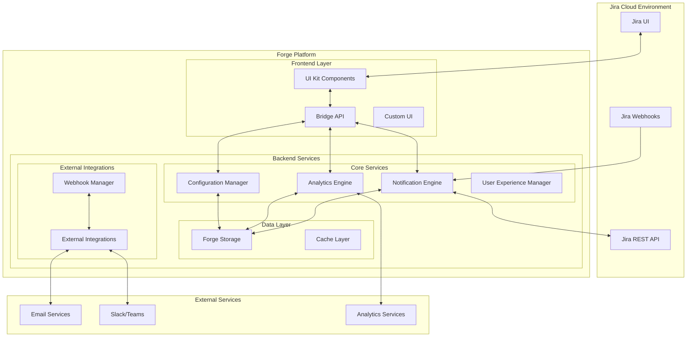
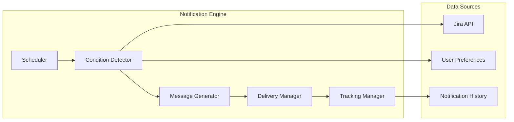
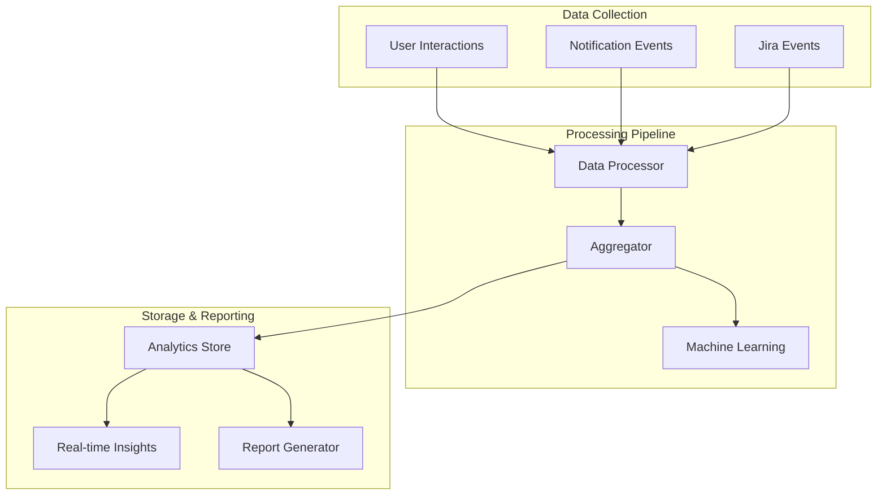
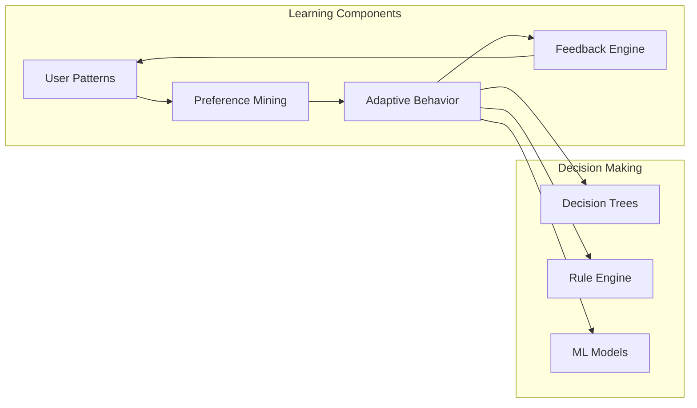
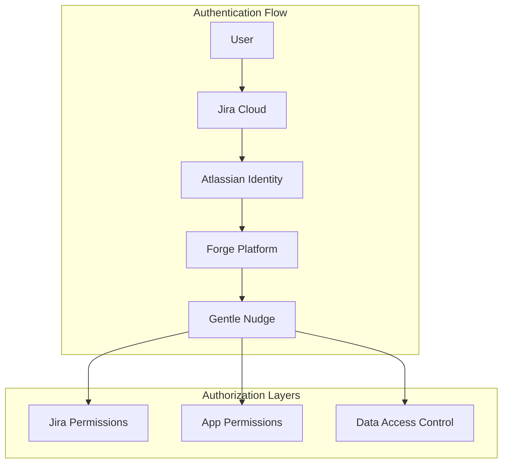
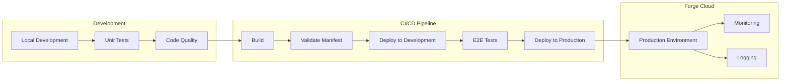

# Architecture Overview - Gentle Nudge Assistant

This document provides a comprehensive overview of the Gentle Nudge Assistant's technical architecture, design decisions, and system components.

## Table of Contents

1. [High-Level Architecture](#high-level-architecture)
2. [Platform and Technology Stack](#platform-and-technology-stack)
3. [Core Components](#core-components)
4. [Data Architecture](#data-architecture)
5. [Security Architecture](#security-architecture)
6. [Scalability and Performance](#scalability-and-performance)
7. [Integration Points](#integration-points)
8. [Deployment Architecture](#deployment-architecture)
9. [Monitoring and Observability](#monitoring-and-observability)
10. [Design Patterns and Principles](#design-patterns-and-principles)

## High-Level Architecture

Gentle Nudge Assistant is built as a cloud-native application on the Atlassian Forge platform, designed for scalability, security, and seamless integration with Jira Cloud.



## Platform and Technology Stack

### Atlassian Forge Platform

**Core Framework:**
- **Runtime**: Serverless functions with automatic scaling
- **Storage**: Key-value store with built-in encryption
- **Authentication**: Integrated with Atlassian identity
- **UI Framework**: Forge UI Kit for consistent Jira integration

**Benefits of Forge Platform:**
- Native Jira integration with full API access
- Built-in security and compliance (SOC 2, GDPR)
- Automatic scaling and high availability
- No infrastructure management required
- Seamless updates and deployment

### Technology Stack

```yaml
Frontend:
  framework: "Forge UI Kit"
  language: "JavaScript/TypeScript"
  ui_components: "@forge/ui"
  bridge_api: "@forge/bridge"
  
Backend:
  runtime: "Node.js 18.x LTS"
  language: "TypeScript"
  framework: "Custom microservices"
  
Data Storage:
  primary: "Forge Storage (encrypted key-value)"
  cache: "In-memory caching with TTL"
  backup: "Automatic Forge backups"
  
External APIs:
  jira: "Jira Cloud REST API v3"
  atlassian: "Atlassian Cloud APIs"
  
Development:
  build_tool: "Webpack + Forge CLI"
  testing: "Jest + Testing Library"
  linting: "ESLint + Prettier"
  type_checking: "TypeScript strict mode"
```

## Core Components

### 1. Notification Engine

The heart of the system, responsible for intelligent notification generation and delivery.

#### Architecture



#### Key Modules

**Scheduler Service** (`/src/notification-engine/scheduler.ts`)
```typescript
interface SchedulerService {
  // Core scheduling functionality
  scheduleAnalysis(userId: string, interval: number): Promise<void>;
  executeScheduledTasks(): Promise<void>;
  
  // Dynamic scheduling based on user patterns
  optimizeScheduling(userId: string, patterns: UserPattern[]): Promise<void>;
  
  // Workload-aware scheduling
  adjustForWorkload(userId: string, workload: WorkloadAnalysis): Promise<void>;
}

class NotificationScheduler implements SchedulerService {
  private intervals: Map<string, NodeJS.Timer> = new Map();
  
  async scheduleAnalysis(userId: string, interval: number) {
    // Implementation for dynamic user-specific scheduling
    const timer = setInterval(async () => {
      await this.analyzeAndNotify(userId);
    }, interval);
    
    this.intervals.set(userId, timer);
  }
  
  private async analyzeAndNotify(userId: string) {
    const preferences = await this.getUserPreferences(userId);
    const workload = await this.analyzeWorkload(userId);
    
    if (this.shouldSkipDueToWorkload(workload)) {
      return;
    }
    
    await this.processNotifications(userId, preferences);
  }
}
```

**Condition Detector** (`/src/notification-engine/detector.ts`)
```typescript
interface NotificationCondition {
  evaluate(context: NotificationContext): Promise<boolean>;
  getPriority(): number;
  getType(): NotificationType;
}

class StaleTicketDetector implements NotificationCondition {
  async evaluate(context: NotificationContext): Promise<boolean> {
    const { issue, userPreferences } = context;
    const daysSinceUpdate = this.calculateDaysSinceUpdate(issue);
    
    return daysSinceUpdate >= userPreferences.staleDaysThreshold &&
           this.isWorkingHours(userPreferences.quietHours) &&
           !this.isOverloaded(context.workload);
  }
  
  private calculateDaysSinceUpdate(issue: Issue): number {
    return Math.floor(
      (Date.now() - new Date(issue.fields.updated).getTime()) / 
      (1000 * 60 * 60 * 24)
    );
  }
}
```

### 2. Analytics Engine

Provides insights into user behavior, notification effectiveness, and system performance.

#### Data Processing Pipeline



#### Implementation

**Analytics Processor** (`/src/analytics/processor.ts`)
```typescript
class AnalyticsProcessor {
  async processUserInteraction(event: UserInteractionEvent): Promise<void> {
    // Real-time processing of user interactions
    const analysis = await this.analyzeInteraction(event);
    
    // Update user patterns
    await this.updateUserPatterns(event.userId, analysis);
    
    // Trigger ML model updates if needed
    if (this.shouldUpdateModel(analysis)) {
      await this.updatePredictionModel(event.userId);
    }
  }
  
  private async analyzeInteraction(event: UserInteractionEvent): Promise<InteractionAnalysis> {
    return {
      responseTime: event.timestamp - event.notificationSent,
      effectivenessScore: this.calculateEffectiveness(event),
      userSatisfaction: event.feedback?.rating || null,
      contextFactors: this.extractContextFactors(event)
    };
  }
}
```

### 3. User Experience Manager

Manages personalization, learning, and adaptive behavior based on user interactions.

#### Learning System Architecture



**Adaptive Behavior Engine** (`/src/ux/adaptive-behavior.ts`)
```typescript
interface AdaptiveBehaviorEngine {
  adaptToUserPatterns(userId: string): Promise<void>;
  optimizeNotificationTiming(userId: string): Promise<TimePreferences>;
  adjustNotificationFrequency(userId: string): Promise<FrequencySettings>;
}

class UserExperienceManager implements AdaptiveBehaviorEngine {
  private patternAnalyzer: PatternAnalyzer;
  private mlPredictor: MLPredictor;
  
  async adaptToUserPatterns(userId: string): Promise<void> {
    const patterns = await this.patternAnalyzer.analyze(userId);
    const predictions = await this.mlPredictor.predict(userId, patterns);
    
    // Adapt notification timing
    if (patterns.optimalResponseTimes.length > 10) {
      await this.optimizeNotificationTiming(userId);
    }
    
    // Adapt content style
    if (patterns.preferredTones.size > 0) {
      await this.optimizeMessageTone(userId, patterns.preferredTones);
    }
    
    // Adapt frequency based on effectiveness
    if (patterns.effectivenessScores.average < 0.6) {
      await this.reduceNotificationFrequency(userId);
    }
  }
}
```

### 4. Configuration Manager

Handles user preferences, team settings, and system configuration with validation and migration support.

```typescript
interface ConfigurationManager {
  getUserPreferences(userId: string): Promise<UserPreferences>;
  updateUserPreferences(userId: string, preferences: Partial<UserPreferences>): Promise<void>;
  validateConfiguration(config: any): Promise<ValidationResult>;
  migrateConfiguration(userId: string, fromVersion: string, toVersion: string): Promise<void>;
}

class ForgeConfigurationManager implements ConfigurationManager {
  private storage: ForgeStorage;
  private validator: ConfigValidator;
  private migrator: ConfigMigrator;
  
  async getUserPreferences(userId: string): Promise<UserPreferences> {
    const key = `user_preferences_${userId}`;
    const stored = await this.storage.get(key);
    
    if (!stored) {
      return this.getDefaultPreferences(userId);
    }
    
    // Check if migration is needed
    if (stored.version !== CURRENT_CONFIG_VERSION) {
      return await this.migrateAndReturn(userId, stored);
    }
    
    return stored;
  }
  
  private async getDefaultPreferences(userId: string): Promise<UserPreferences> {
    const userProfile = await this.getUserProfile(userId);
    
    return {
      userId,
      notificationFrequency: 'gentle',
      staleDaysThreshold: 5,
      deadlineWarningDays: [7, 3, 1],
      communicationTone: 'encouraging',
      quietHours: this.inferQuietHours(userProfile.timezone),
      // ... other defaults
      version: CURRENT_CONFIG_VERSION,
      createdAt: new Date(),
      lastModified: new Date()
    };
  }
}
```

## Data Architecture

### Data Models

#### User Preferences Model
```typescript
interface UserPreferences {
  // Identity
  userId: string;
  version: string;
  createdAt: Date;
  lastModified: Date;
  
  // Core Preferences
  notificationFrequency: 'minimal' | 'gentle' | 'moderate' | 'custom';
  staleDaysThreshold: number;
  deadlineWarningDays: number[];
  communicationTone: 'encouraging' | 'professional' | 'casual' | 'custom';
  
  // Scheduling
  quietHours: QuietHours;
  workloadSensitivity: boolean;
  maxDailyNotifications: number;
  
  // Filtering
  projectFilters: ProjectFilters;
  priorityFilters: string[];
  issueTypeFilters: string[];
  labelFilters: LabelFilters;
  
  // Advanced
  learningEnabled: boolean;
  customTemplates: CustomTemplate[];
  integrationSettings: IntegrationSettings;
}
```

#### Notification Model
```typescript
interface Notification {
  // Identity
  id: string;
  userId: string;
  type: NotificationType;
  
  // Content
  title: string;
  message: string;
  actions: NotificationAction[];
  
  // Context
  issueKey?: string;
  projectKey?: string;
  priority: 'low' | 'medium' | 'high' | 'critical';
  
  // Lifecycle
  status: 'pending' | 'sent' | 'delivered' | 'read' | 'dismissed' | 'actioned';
  createdAt: Date;
  scheduledFor?: Date;
  sentAt?: Date;
  respondedAt?: Date;
  expiresAt?: Date;
  
  // Tracking
  response?: 'dismissed' | 'acknowledged' | 'actioned' | 'snoozed';
  effectivenessScore?: number;
  feedback?: UserFeedback;
  
  // Metadata
  metadata: Record<string, any>;
  version: string;
}
```

### Storage Strategy

**Primary Storage: Forge Key-Value Store**
```typescript
// Storage organization
const STORAGE_KEYS = {
  USER_PREFERENCES: (userId: string) => `prefs:${userId}`,
  NOTIFICATION_HISTORY: (userId: string) => `notifications:${userId}`,
  ANALYTICS_DATA: (userId: string) => `analytics:${userId}`,
  TEAM_SETTINGS: (projectKey: string) => `team:${projectKey}`,
  GLOBAL_CONFIG: 'global_config',
  CACHE_PREFIX: 'cache:'
} as const;

class ForgeDataManager {
  async storeUserPreferences(preferences: UserPreferences): Promise<void> {
    const key = STORAGE_KEYS.USER_PREFERENCES(preferences.userId);
    await storage.set(key, {
      ...preferences,
      lastModified: new Date(),
      version: CURRENT_VERSION
    });
  }
  
  async getNotificationHistory(
    userId: string, 
    options: { limit?: number; offset?: number } = {}
  ): Promise<Notification[]> {
    const key = STORAGE_KEYS.NOTIFICATION_HISTORY(userId);
    const data = await storage.get(key) || [];
    
    const { limit = 50, offset = 0 } = options;
    return data
      .sort((a, b) => new Date(b.createdAt).getTime() - new Date(a.createdAt).getTime())
      .slice(offset, offset + limit);
  }
}
```

**Caching Strategy**
```typescript
interface CacheManager {
  get<T>(key: string): Promise<T | null>;
  set<T>(key: string, value: T, ttl?: number): Promise<void>;
  invalidate(pattern: string): Promise<void>;
  clear(): Promise<void>;
}

class InMemoryCacheManager implements CacheManager {
  private cache = new Map<string, { value: any; expires: number }>();
  
  async get<T>(key: string): Promise<T | null> {
    const entry = this.cache.get(key);
    
    if (!entry || Date.now() > entry.expires) {
      this.cache.delete(key);
      return null;
    }
    
    return entry.value;
  }
  
  async set<T>(key: string, value: T, ttl: number = 300000): Promise<void> {
    this.cache.set(key, {
      value,
      expires: Date.now() + ttl
    });
  }
}
```

## Security Architecture

### Security Principles

1. **Zero Trust Architecture**: No implicit trust, verify everything
2. **Least Privilege Access**: Minimal permissions required for functionality
3. **Data Minimization**: Collect only necessary data
4. **Encryption Everywhere**: Data encrypted in transit and at rest
5. **Audit Trail**: Complete logging of all data access and modifications

### Authentication and Authorization



**Security Implementation**
```typescript
interface SecurityManager {
  validatePermissions(userId: string, resource: string, action: string): Promise<boolean>;
  auditAccess(userId: string, resource: string, action: string): Promise<void>;
  sanitizeInput(input: any): any;
  encryptSensitiveData(data: any): Promise<string>;
}

class ForgeSecurityManager implements SecurityManager {
  async validatePermissions(userId: string, resource: string, action: string): Promise<boolean> {
    // Check Jira permissions via API
    const jiraPermissions = await this.getJiraPermissions(userId);
    
    // Check app-specific permissions
    const appPermissions = await this.getAppPermissions(userId);
    
    // Validate against resource and action
    return this.evaluatePermissions(jiraPermissions, appPermissions, resource, action);
  }
  
  async auditAccess(userId: string, resource: string, action: string): Promise<void> {
    const auditEntry = {
      timestamp: new Date(),
      userId,
      resource,
      action,
      ipAddress: this.getClientIP(),
      userAgent: this.getUserAgent()
    };
    
    await this.storeAuditLog(auditEntry);
  }
}
```

### Data Protection

**Encryption at Rest**
```typescript
class DataEncryption {
  private readonly encryptionKey: string;
  
  async encryptSensitive(data: any): Promise<string> {
    const sensitive = this.identifySensitiveFields(data);
    
    if (sensitive.length === 0) {
      return JSON.stringify(data);
    }
    
    const encrypted = await this.encrypt(JSON.stringify(sensitive));
    const cleaned = this.removeSensitiveFields(data);
    
    return JSON.stringify({
      ...cleaned,
      _encrypted: encrypted
    });
  }
  
  private identifySensitiveFields(data: any): string[] {
    const sensitivePatterns = [
      /email/i,
      /password/i,
      /token/i,
      /secret/i,
      /private/i
    ];
    
    return Object.keys(data).filter(key =>
      sensitivePatterns.some(pattern => pattern.test(key))
    );
  }
}
```

## Scalability and Performance

### Scaling Strategy

**Horizontal Scaling via Forge Platform**
- Automatic serverless function scaling
- Event-driven architecture for optimal resource usage
- Stateless design for unlimited scalability

**Performance Optimization**
```typescript
class PerformanceOptimizer {
  // Batch processing for efficiency
  async processBatchNotifications(users: string[]): Promise<void> {
    const batches = this.createBatches(users, 10); // Process 10 users at a time
    
    for (const batch of batches) {
      await Promise.all(
        batch.map(userId => this.processUserNotifications(userId))
      );
    }
  }
  
  // Smart caching strategy
  async getIssuesWithCache(projectKey: string): Promise<Issue[]> {
    const cacheKey = `issues:${projectKey}`;
    const cached = await this.cache.get(cacheKey);
    
    if (cached) {
      return cached;
    }
    
    const issues = await this.jiraAPI.getProjectIssues(projectKey);
    await this.cache.set(cacheKey, issues, 300000); // 5 minute cache
    
    return issues;
  }
}
```

### Performance Monitoring

```typescript
interface PerformanceMetrics {
  notificationProcessingTime: number;
  apiResponseTime: number;
  userEngagementRate: number;
  systemThroughput: number;
}

class PerformanceMonitor {
  async trackMetrics(operation: string, fn: () => Promise<any>): Promise<any> {
    const startTime = Date.now();
    let error: Error | null = null;
    let result: any;
    
    try {
      result = await fn();
    } catch (e) {
      error = e as Error;
      throw e;
    } finally {
      const duration = Date.now() - startTime;
      
      await this.recordMetric({
        operation,
        duration,
        success: !error,
        timestamp: new Date()
      });
    }
    
    return result;
  }
}
```

## Integration Points

### Jira Cloud Integration

**API Integration Strategy**
```typescript
class JiraIntegrationManager {
  private rateLimiter: RateLimiter;
  private cache: CacheManager;
  
  async getIssues(jql: string, options: JQLOptions = {}): Promise<Issue[]> {
    // Rate limiting
    await this.rateLimiter.waitForToken();
    
    // Cache check
    const cacheKey = `jql:${btoa(jql)}:${JSON.stringify(options)}`;
    const cached = await this.cache.get(cacheKey);
    
    if (cached) {
      return cached;
    }
    
    // API call with retry logic
    const result = await this.withRetry(async () => {
      return await requestJira('/rest/api/3/search', {
        method: 'POST',
        body: JSON.stringify({ jql, ...options })
      });
    });
    
    // Cache successful response
    await this.cache.set(cacheKey, result.issues, 300000);
    
    return result.issues;
  }
}
```

### External Service Integration

**Webhook Integration**
```typescript
interface WebhookManager {
  registerWebhook(config: WebhookConfig): Promise<string>;
  sendWebhook(event: WebhookEvent): Promise<void>;
  retryFailedWebhooks(): Promise<void>;
}

class ForgeWebhookManager implements WebhookManager {
  async sendWebhook(event: WebhookEvent): Promise<void> {
    const webhooks = await this.getActiveWebhooks(event.type);
    
    const promises = webhooks.map(async (webhook) => {
      try {
        await this.deliverWebhook(webhook, event);
      } catch (error) {
        await this.handleWebhookFailure(webhook, event, error);
      }
    });
    
    await Promise.allSettled(promises);
  }
  
  private async deliverWebhook(webhook: Webhook, event: WebhookEvent): Promise<void> {
    const payload = this.buildPayload(event);
    const signature = this.signPayload(payload, webhook.secret);
    
    const response = await fetch(webhook.url, {
      method: 'POST',
      headers: {
        'Content-Type': 'application/json',
        'X-Gentle-Nudge-Signature': signature,
        'X-Gentle-Nudge-Event': event.type
      },
      body: JSON.stringify(payload)
    });
    
    if (!response.ok) {
      throw new Error(`Webhook delivery failed: ${response.status}`);
    }
  }
}
```

## Deployment Architecture

### Forge Deployment Pipeline



**Deployment Configuration**
```yaml
# manifest.yml
modules:
  function:
    - key: notification-processor
      handler: src/functions/notification-processor.tsx
      
  jiraIssuePanel:
    - key: gentle-nudge-panel
      resource: main
      resolver:
        function: resolver
      title: Gentle Nudge Assistant
      
app:
  runtime:
    name: nodejs18.x
    
  permissions:
    scopes:
      - read:jira-work
      - read:jira-user
      - storage:app
      
  storage:
    encryption: true
    
environments:
  development:
    variables:
      LOG_LEVEL: debug
      CACHE_TTL: 60
      
  production:
    variables:
      LOG_LEVEL: info
      CACHE_TTL: 300
```

## Monitoring and Observability

### Logging Strategy

```typescript
interface Logger {
  debug(message: string, context?: any): void;
  info(message: string, context?: any): void;
  warn(message: string, context?: any): void;
  error(message: string, error?: Error, context?: any): void;
}

class ForgeLogger implements Logger {
  info(message: string, context?: any): void {
    console.log(JSON.stringify({
      timestamp: new Date().toISOString(),
      level: 'INFO',
      message,
      context,
      traceId: this.getTraceId()
    }));
  }
  
  error(message: string, error?: Error, context?: any): void {
    console.error(JSON.stringify({
      timestamp: new Date().toISOString(),
      level: 'ERROR',
      message,
      error: error?.stack,
      context,
      traceId: this.getTraceId()
    }));
  }
}
```

### Health Monitoring

```typescript
class HealthMonitor {
  async checkHealth(): Promise<HealthStatus> {
    const checks = await Promise.allSettled([
      this.checkJiraConnectivity(),
      this.checkStorageHealth(),
      this.checkNotificationProcessing(),
      this.checkCachePerformance()
    ]);
    
    return {
      status: checks.every(check => check.status === 'fulfilled') ? 'healthy' : 'unhealthy',
      timestamp: new Date(),
      checks: checks.map((check, index) => ({
        name: this.getCheckName(index),
        status: check.status === 'fulfilled' ? 'pass' : 'fail',
        details: check.status === 'rejected' ? check.reason : undefined
      }))
    };
  }
}
```

## Design Patterns and Principles

### Architectural Principles

1. **Single Responsibility**: Each component has one clear purpose
2. **Open/Closed**: Open for extension, closed for modification  
3. **Dependency Inversion**: Depend on abstractions, not concretions
4. **Event-Driven Architecture**: Loose coupling through events
5. **Fail-Fast Design**: Early detection and handling of errors

### Key Design Patterns

**Strategy Pattern for Notification Types**
```typescript
interface NotificationStrategy {
  shouldNotify(context: NotificationContext): Promise<boolean>;
  generateMessage(context: NotificationContext): Promise<string>;
  getFrequency(): number;
}

class StaleTicketStrategy implements NotificationStrategy {
  async shouldNotify(context: NotificationContext): Promise<boolean> {
    const { issue, preferences } = context;
    return this.calculateStaleness(issue) >= preferences.staleDaysThreshold;
  }
}

class NotificationEngine {
  private strategies: Map<string, NotificationStrategy> = new Map();
  
  registerStrategy(type: string, strategy: NotificationStrategy): void {
    this.strategies.set(type, strategy);
  }
  
  async processNotifications(context: NotificationContext): Promise<void> {
    for (const [type, strategy] of this.strategies) {
      if (await strategy.shouldNotify(context)) {
        const message = await strategy.generateMessage(context);
        await this.deliverNotification(message, type);
      }
    }
  }
}
```

**Observer Pattern for User Actions**
```typescript
interface NotificationObserver {
  onNotificationSent(notification: Notification): Promise<void>;
  onNotificationResponded(notification: Notification, response: string): Promise<void>;
}

class AnalyticsObserver implements NotificationObserver {
  async onNotificationSent(notification: Notification): Promise<void> {
    await this.recordEvent('notification_sent', {
      type: notification.type,
      userId: notification.userId,
      timestamp: new Date()
    });
  }
}
```

**Factory Pattern for Message Generation**
```typescript
interface MessageFactory {
  createMessage(type: string, context: MessageContext): Promise<Message>;
}

class EncouragingMessageFactory implements MessageFactory {
  async createMessage(type: string, context: MessageContext): Promise<Message> {
    const template = await this.getTemplate(type, 'encouraging');
    const message = await this.populateTemplate(template, context);
    
    return {
      title: message.title,
      body: message.body,
      tone: 'encouraging',
      actions: this.generateActions(context)
    };
  }
}
```

---

This architecture overview provides the foundation for understanding how Gentle Nudge Assistant is built to be scalable, secure, and maintainable while delivering a delightful user experience. The modular design allows for easy extension and customization while maintaining the core principles of encouraging, positive interaction with Jira tickets.

*Next: [Contributing Guide →](contributing-guide.md)*